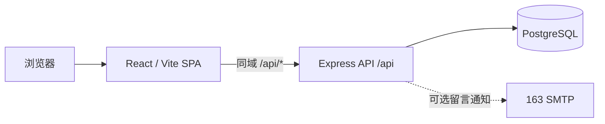
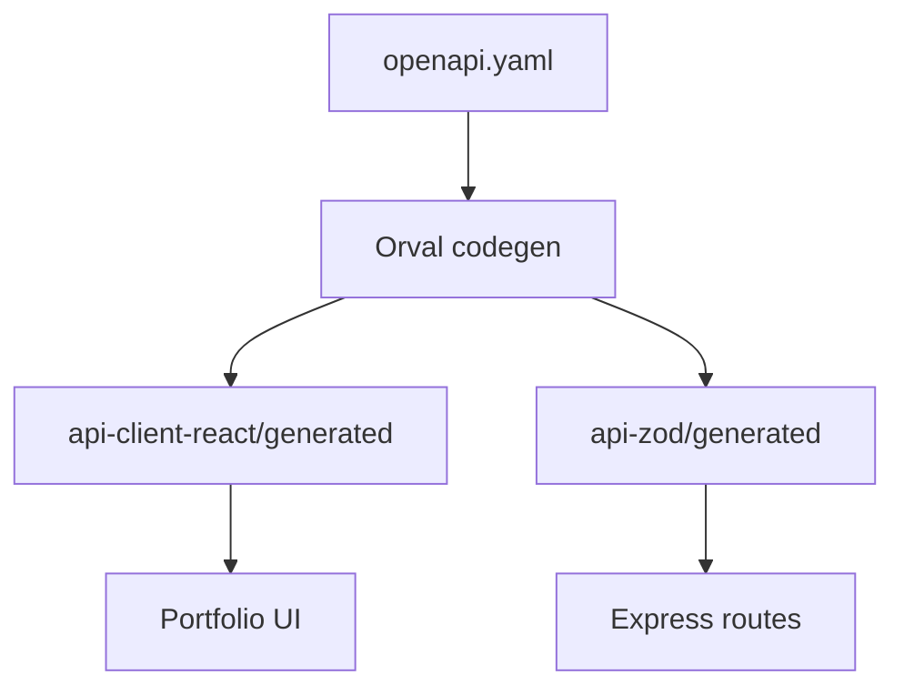
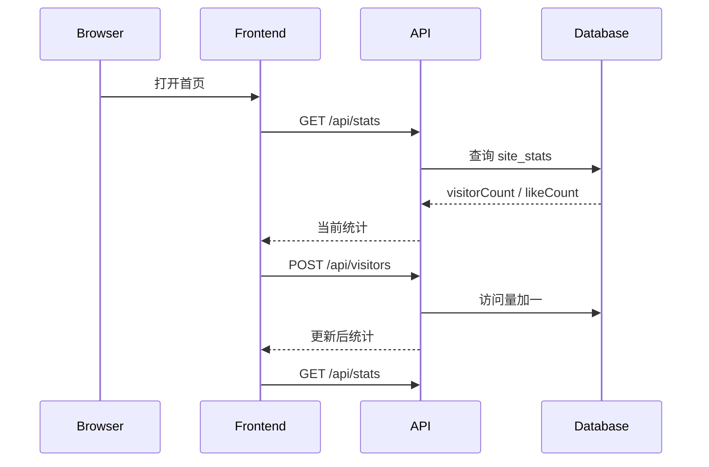
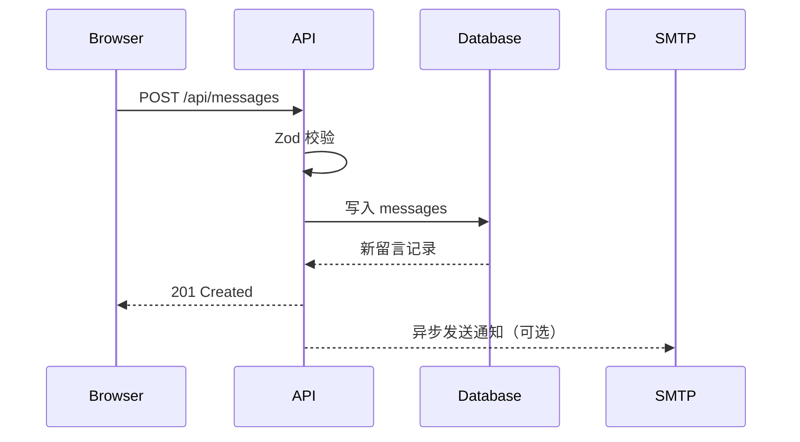

# Mercy Portfolio 系统架构

## 1. 架构概览

Mercy Portfolio 是一个 pnpm monorepo，由静态 React 前端、Node.js API、PostgreSQL 数据库和 OpenAPI 代码生成链路组成。

它不是纯静态网站。简历正文可以由静态前端提供，但访问量、点赞和留言依赖 API 与数据库。



## 2. Monorepo 结构

```text
.
├── artifacts/
│   ├── portfolio/          # React/Vite 前端
│   └── api-server/         # Express API
├── lib/
│   ├── api-spec/           # OpenAPI 契约和 Orval 配置
│   ├── api-client-react/   # 生成的 React Query 客户端
│   ├── api-zod/            # 生成的 Zod schema
│   └── db/                 # Drizzle 连接与数据库 schema
├── README.md               # 运行说明
├── PRD.md                  # 产品需求基线
├── STYLE.md                # 样式基线
└── AGENTS.md               # 维护约束
```

## 3. 运行时组件

### 3.1 Portfolio Frontend

位置：`artifacts/portfolio`

职责：

- 展示中英双语简历内容；
- 管理页签、语言、弹窗和点赞本地状态；
- 通过生成的 React Query hooks 调用 `/api`；
- 提供访问量、点赞量和留言交互；
- 构建静态 SPA 文件。

关键入口：

- `src/main.tsx`：React 挂载入口；
- `src/App.tsx`：路由、Provider、背景和全局外壳；
- `src/pages/home.tsx`：主要内容、交互和翻译数据；
- `src/index.css`：全局 token 和样式系统；
- `vite.config.ts`：构建目录、基础路径和开发代理。

生产构建输出：`artifacts/portfolio/dist/public`

### 3.2 API Server

位置：`artifacts/api-server`

技术：Express 5、Pino、Zod、Drizzle。

职责：

- 提供健康检查；
- 查询与更新访问量、点赞量；
- 校验并保存访客留言；
- 在配置 SMTP 时发送留言通知；
- 记录 HTTP 请求日志。

所有业务路由统一挂载在 `/api`：

| 方法 | 路径 | 实现 |
| --- | --- | --- |
| GET | `/api/healthz` | `routes/health.ts` |
| GET | `/api/stats` | `routes/stats.ts` |
| POST | `/api/visitors` | `routes/stats.ts` |
| POST | `/api/likes` | `routes/stats.ts` |
| POST | `/api/messages` | `routes/messages.ts` |

生产构建入口：`artifacts/api-server/dist/index.mjs`

### 3.3 Database Library

位置：`lib/db`

职责：

- 从 `DATABASE_URL` 创建 PostgreSQL 连接池；
- 创建 Drizzle 数据库实例；
- 导出共享 schema 与类型。

当前数据表：

- `site_stats`：累计访问量和累计点赞量；
- `messages`：访客姓名、留言内容和创建时间。

数据库在模块加载时要求存在 `DATABASE_URL`，但连接通常在第一次查询时建立。

### 3.4 Mailer

位置：`artifacts/api-server/src/lib/mailer.ts`

留言成功入库后，API 异步尝试通过 163 SMTP 发送 HTML 通知邮件。

- `SMTP_USER` 和 `SMTP_PASS` 未配置时跳过邮件；
- `NOTIFY_EMAIL` 未配置时默认使用 `SMTP_USER`；
- 邮件失败会记录日志，但不会改变留言接口的成功结果。

## 4. API 契约与代码生成

`lib/api-spec/openapi.yaml` 是前后端共享接口契约的唯一来源。



生成命令：

```bash
pnpm run codegen
```

生成结果：

- `lib/api-client-react/src/generated/`：请求函数、类型和 React Query hooks；
- `lib/api-zod/src/generated/`：服务端使用的请求与响应 schema。

生成目录不应手工修改。接口变更顺序应为：

1. 修改 `openapi.yaml`；
2. 修改 Express 路由实现；
3. 运行 `pnpm run codegen`；
4. 修正调用方类型错误；
5. 运行 `pnpm run build`。

## 5. 主要数据流

### 5.1 页面访问



当前访问统计按页面组件挂载次数累计，不是独立访客 UV。

### 5.2 点赞

1. 前端读取 `localStorage.mercy_liked`。
2. 未点赞用户点击按钮后调用 `POST /api/likes`。
3. API 更新 `site_stats.like_count`。
4. 前端写入本地标记并刷新统计。

本地标记只限制当前浏览器，服务端没有用户身份或全局去重。

### 5.3 留言



## 6. 开发拓扑

本地开发通常运行两个进程：

```text
http://localhost:5173  Vite 前端
          │
          └── /api proxy ──> http://localhost:8080  Express API
                                      │
                                      └── PostgreSQL
```

Vite 代理目标通过 `API_PROXY_TARGET` 配置，默认是 `http://localhost:8080`。

## 7. 生产拓扑要求

推荐保持前端与 API 对浏览器表现为同一域名：

```text
https://example.com/*       -> 静态前端
https://example.com/api/*   -> Node.js API
```

原因：生成客户端使用相对路径 `/api`。如果 API 使用独立子域名，则需要修改客户端基础地址、环境变量策略和 CORS 配置。

静态服务还需要将未知 SPA 路径回退到 `index.html`。

## 8. 构建流程

根命令：

```bash
pnpm run build
```

执行顺序：

1. 根据 OpenAPI 重新生成客户端与 Zod schema；
2. 强制构建共享 TypeScript library 声明；
3. 对前端和 API 执行类型检查；
4. 构建 API bundle；
5. 构建前端静态资源。

关键产物：

- `artifacts/portfolio/dist/public/index.html`；
- `artifacts/api-server/dist/index.mjs`。

## 9. 配置边界

| 变量 | 组件 | 必需 | 用途 |
| --- | --- | --- | --- |
| `PORT` | API | 是 | API 监听端口 |
| `DATABASE_URL` | API / DB | 是 | PostgreSQL 连接 |
| `SMTP_USER` | API | 否 | 163 SMTP 用户名 |
| `SMTP_PASS` | API | 否 | SMTP 授权凭据 |
| `NOTIFY_EMAIL` | API | 否 | 留言通知收件人 |
| `PORT` | 前端开发 | 否 | Vite 端口，默认 5173 |
| `BASE_PATH` | 前端 | 否 | 静态部署基础路径，默认 `/` |
| `API_PROXY_TARGET` | 前端开发 | 否 | 本地 API 代理目标 |

生产密钥只能通过部署环境注入，不进入前端 bundle，也不写入仓库。

## 10. 当前架构限制

这些限制已在 `PRD.md` 中列为上线前事项，此处只描述技术影响：

- 统计更新采用先读取、再写入，存在并发覆盖风险；
- 点赞和访问接口没有服务端身份去重；
- 留言接口尚无长度上限和限流；
- CORS 当前使用默认全开放配置；
- 邮件 HTML 尚未对访客输入做显式转义；
- 简历内容与页面组件集中在较大的 `home.tsx` 文件中；
- 当前没有自动化测试套件和 CI 工作流。

修复这些问题时应保持接口契约、数据库 schema 和 PRD 同步。

## 11. 相关文档

- 本地运行与环境变量：`README.md`
- 产品需求与发布验收：`PRD.md`
- 视觉与组件规范：`STYLE.md`
- 自动化维护规则：`AGENTS.md`
- 具体平台部署步骤：待确定部署平台后补充 `DEPLOYMENT.md`
